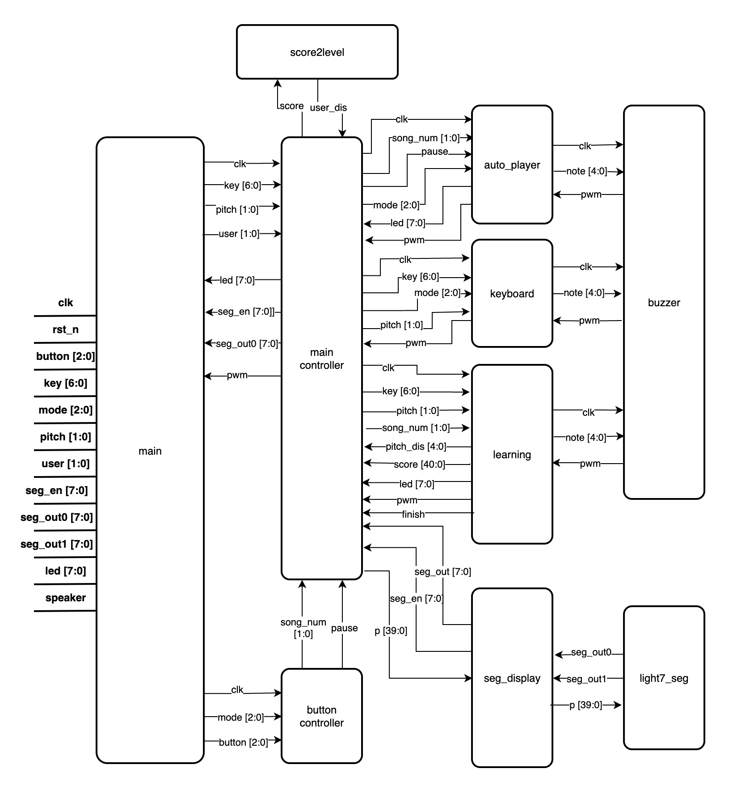

<div align='center'>

# SUSTech CS207 Digital Design Project<br> Piano
A Mini Piano Toy ~~not playable~~
</div>

## Introduction
In this semester project, we implement a piano toy with learn mode
and music player on the Xilinx(TM) FPGA EGO1 board, and the code
is written in `Verilog`. Inside the piano, we put four songs for you to enjoy,
`Twinkle Twinkle Little Star`, `Haruhikake`, `Ode to Joy` and `Jingle Bell`.
The implementation seems quite simple and straight forward, but it works pretty well.
That's exactly what we need. Anyway, enjoy your time with the toy!

## Features
 - [x] Mode Switching & Display
 - [x] Free Mode
    + [x] Play Notes
    + [x] Three Octaves (C3 - C5)
 - [x] Autoplay Mode
    + [x] Play Songs Automatically
    + [x] Index of Song Display
    + [x] Song Switching
    + [x] LED Cue of Notes
    + [x] Pause during Play (*Bonus*)
    + [x] Support Crotchet and Quaver (*Bonus*)
 - [x] Learning Mode
    + [x] LED Cue during Learning
    + [x] Evaluation of Learning
    + [x] Multiple User and profile
 - [ ] Key Adjustment (*Bonus*)
 - [ ] VGA Display (*Bonus*)
 - [ ] Song Record & Replay (*Bonus*)
 - [ ] Detailed Evalution (*Bonus*)

## User Manual
When turning on the board, a welcome message "HELLO" will be displayed.
And then you can start using it by changing the mode first.
The tiny switches of SW8 has two functions. The right most three switches is for changing mode
| Mode | Switch | Function |
| ---- | ------ | -------- |
| Free |  001   | Play the piano |
| Auto |  011   | Play songs automatically |
| Learning | 111 | Play throught the instruction|

And the left most two switches is for changing user in learning mode.
When you enter a mode, the name of current mode will be displayed on the segtube.

### Free Mode
The switches (SW6 - SW0) is the keys of piano
```
SW0 - SW7
┌─┐ ┌─┐ ┌─┐ ┌─┐ ┌─┐ ┌─┐ ┌─┐ 
│ │ │ │ │ │ │ │ │ │ │ │ │ │ 
└─┘ └─┘ └─┘ └─┘ └─┘ └─┘ └─┘ 
 │   │   │   │   │   │   │ 

 Si  La  So  Fa  Mi  Re  Do
```
When you turn on one of them, the corresponding note will be played.
Note that more than one keys turned on at the same time will not play any notes.
On the right of the board, the up button(S4) is used to play the higher octaves and the down button is for the lower octaves, e.g., when you turn on the key `Do` while pressing the up
button, the piano will play `C5` instead of `C4`.

### Auto Mode
When you feel tired of playing by yourself, you can ask the board to play songs automatically
by switching into auto mode. The piano has 3 songs built in (if you want add more, feel free to notify me in **Issue**), `Twinkle Twinkle Little Star`, `Haruhikage`, `Ode to Joy` and `Jingle Bell`.
The song is switched by the buttons, left for previous song, right for next song. And
the middle button can control the pause of song if you'd like it to pause for a while.
```
                  0 -- High pitch(Free Mode)

Previous --  0    0    0 -- Pause Next
            
                  0 -- Low pitch(Free Mode)
```
On the segment tube, you can see clearly the index of current song and above the keys,
LEDs of corresponding note played currently will be lighted.

### Learning Mode
After seeing how songs are played, perhaps you'd love to play them on your own. Similar to the auto mode, but this time, you should play the notes with the help of LED indicators.
```
[o] [o] [o] [o] [o] [o] [o]
┌─┐ ┌─┐ ┌─┐ ┌─┐ ┌─┐ ┌─┐ ┌─┐ 
│ │ │ │ │ │ │ │ │ │ │ │ │ │ 
└─┘ └─┘ └─┘ └─┘ └─┘ └─┘ └─┘ 
 │   │   │   │   │   │   │ 

 Si  La  So  Fa  Mi  Re  Do
```
When the LED is on, you must turn on the switch(key) and turn off it when the LED is off AS SOON AS POSSIBLE.
You can change the songs as in the Auto Mode.

After completely learning a song, you can see the grade of your learning on the segment tube. We offer
three levels of grade based on the latency of your pressing.
```
 / __| ___  ___  __| |
| (_ |/ _ \/ _ \/ _` |
 \___|\___/\___/\__/_|
```
```
/ __| ___ / __| ___ 
\__ \/ _ \\__ \/ _ \
|___/\___/|___/\___/
```
```
| _ ) __ _  __| |
| _ \/ _` |/ _` |
|___/\__/_|\__/_|
```
In this mode, you have the first three songs to learn. And the position of the last song is occupied by
the user profile, which is used to display your average score. You can change the user by the left most
two switch of SW8.
```
SW8
┌─┐ ┌─┐ ┌─┐ ┌─┐ ┌─┐ ┌─┐ ┌─┐ 
│ │ │ │ │ │ │ │ │ │ │ │ │ │ 
└─┘ └─┘ └─┘ └─┘ └─┘ └─┘ └─┘ 
 │   │   │   │   │   │   │ 
 |___|           |___|___|
 User            Mode Selec
```

## Installation
1. At first, you should have a `EGO1` board in your hand.

2. Open `Vivado` and create a project. Then import the [sources](sources/) folder into the *design source* and [constr](constr/) folder into *constraints* in the project.

3. Finally, follow the steps in `Vivado`, which are *synthesis*, *implementation* and *generate bitstream*. You should get the bitstream file now.

4. Alternatively, you can use the bitstream provided, which locates at [bit](bit/Piano_2231_0532.bit) and release.

5. Once you get the bitstream, you can connect the board to your computer and click **program device** in the hardware manager panel.

Enjoy it!

## Architecture


### Modules
`main_controller` Module:
 - **Input:**
 - **Output:**
 - **Description:**

`button_controller` Module:
 - **Input:**
 - **Output:**
 - **Description:**

`autoplay` Module:
 - **Input:**
 - **Output:**
 - **Description:**

`keyboard` Module:
 - **Input:**
 - **Output:**
 - **Description:**

`learning` Module:
 - **Input:**
 - **Output:**
 - **Description:**

`buzzer` Module:
 - **Input:**
 - **Output:**
 - **Description:**

`seg_display` Module:
 - **Input:**
 - **Output:**
 - **Description:**

`light7_seg` Module:
 - **Input:**
 - **Output:**
 - **Description:**

`score2level` Module:
 - **Input:**
 - **Output:**
 - **Description:**

### Port Binding
| Port | Pin | Description |
| ---- | --- | ----------- |
|  |   |   |

### Implementation of Bonus


## Contributors
 - [**@Ben Chen**](https://github.com/chanbengz)   *Task:* Program (50%)
 - [**@Zhuo Wang**](https://github.com/we-are-zed) *Task:* Test (50%)

## Development Schedule

|  Task  | Start time | Detail | Status | Estimating | Actual |
| ------ | ---------- | ------ | ------ | ---------- | ------ |
| Main Module | 2023-12-10 | Do the wire planing and architecture design | Finished | 3 Days | 2 Days |
| Buzzer Module | 2023-12-12 | PWM of notes generation | Finished | 2 Days | 1 Day |
| Button_controller Module | 2023-12-13 | Buttons debounce | Finished | 2 Days | 2 Days |
| Seg_display Module | 2023-12-15 | Full 7Seg sisplay | Finished | 2 Days | 2 Days |
| Main_controller Module | 2023-12-17 | Display and PWM signal selector | Finished | 2 Days | 1 Day |
| Keyboard Module | 2023-12-18 | Free Mode and octaves support | Finished | 2 Days | 2 Days |
| Autoplay Module | 2023-12-20 | Auto Mode and flexible tempo | Finished | 2 Days | 2 Days |
| Learning Module | 2023-12-22 | Learning Mode and evaluation rule | Finished | 1 Day | 1 Day |
| Add Songs | 2023-12-23 | Encode the notes of songs for autoplay and learning | Finished | 1 Day | 1 Day |
| Document | 2023-12-24 | Compose project report (aka this README) | Pending | 1 Day | 1 Day |
| Overall Test | 2023-12-25 | Run the final test,  record demo video and prepare for the presentation | Finished | 1 Day | Day |

## Summary
The developemnt procedure is quite challenging and tough, but we finally get there. Hooray! Along the way,
it's full of surprise and unexpected failure, furure cannot be predicted. But when we looked back,
it's certain that you will get what you've written, and the board is operating the way you program it, but
sometimes it's not what you expected. Therefore, we shall test every part, from bottom to the top, to verify
that its behaviour looks what we'd like it to be. Also, it's important to apply the existing code, like the
code that we were taught during lab session, since it's verified by the instrcutors and almost unlikely to
corrupt. As for our product, we would say it's not perfect. We have some ideas about refactoring it and
adding more feature to it.
